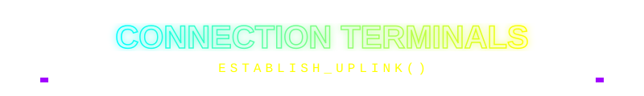

  
  

  ###  Transforming the Future with Artificial Intelligence 
  
  *Final Year B.Tech CSE (Data Science & AI) @ Integral University | Lucknow, India*
  
  

---

## ⚡ Main Protocol: INITIALIZED 

  

 

<table width="100%">
<tr>
<td width="50%" valign="top">

### 👾 About the Architect

I'm an **AI Engineer & Full Stack Developer** passionate about building cutting-edge AI products. I thrive on creating systems that bridge complex machine learning models with sleek, user-centric interfaces. 

🔹 **Core Focus:** Multi-Agent Systems, LLM Applications, RAG Architecture. 
🔹 **Design Philosophy:** Everything must feel alive, intelligent, and premium. 
🔹 **Open Source:** Enthusiast & Hackathon Builder. 
🔹 **Email:** razaainaan@gmail.com

</td>
<td width="50%" valign="top">

### 🎯 Current Focus & Interests

- 🧠 **Artificial Intelligence & Machine Learning**
- 🤖 **Agentic AI & Multi-Agent Systems**
- 💬 **Large Language Models & RAG**
- ☁️ **Cloud Computing & AWS**
- 🐳 **Docker & Kubernetes Deployment**
- 🛠 **System Design & Full Stack Engineering**

</td>
</tr>
</table>

  

---

## 🛠️ Technological Arsenal

### 🧠 AI & Data Science

### 💻 Languages

### ⚙️ Backend & APIs

### 🎨 Frontend

### ☁️ Cloud & DevOps

---

## 🚀 Featured Projects

<table width="100%">
  <tr>
    <td width="33%" align="center">
      <h3>📚 Aidube</h3>
      
<em>AI-Powered Learning Platform</em>

      
Transforms free educational content into structured learning paths. Features AI Notes, Summary, Quizzes, Roadmaps, and a Research Assistant.

    </td>
    <td width="33%" align="center">
      <h3>💸 FinTwin</h3>
      
<em>AI Financial Digital Twin</em>

      
Built during the IBM AWS Agentic Hackathon. Uses RAG, Agentic AI, and advanced Financial Analysis to simulate digital twins.

    </td>
    <td width="33%" align="center">
      <h3>🌿 NaturalHealer</h3>
      
<em>AI Healthcare Platform</em>

      
Combines traditional medicine knowledge with cutting-edge AI diagnostic support and personalized care suggestions.

    </td>
  </tr>
</table>

  

---

## 🏆 Experience & Achievements

- 🥇 **IBM AWS Hackathon Winner**
- 🥇 **Internal Smart India Hackathon Winner**
- 💼 **AI and LLM Intern @ Sipher Web Pvt Ltd**
- 🌟 **Hackathon Builder & Open Source Enthusiast**

---

  

### Contribution Grid Matrix
<!-- The Snake Action pushes to the dist/output branch. Give it a minute after running the workflow! -->
<picture>
  <source media="(prefers-color-scheme: dark)" srcset="https://raw.githubusercontent.com/ainaanraza/ainaanraza/output/github-contribution-grid-snake-dark.svg">
  <source media="(prefers-color-scheme: light)" srcset="https://raw.githubusercontent.com/ainaanraza/ainaanraza/output/github-contribution-grid-snake.svg">
  
</picture>

 

### 3D Contribution Render
<!-- Note: The 3D render is generated by the GitHub Actions workflow. Once the "3D.yml" action finishes running in your repository, this image will automatically appear! -->

 

### Stats & Activity Log

<table width="100%">
  <tr>
    <td width="50%" align="center">
      <!-- GitHub Stats instance is currently 503 Server Unavailable -->
      <!--  -->
      
    </td>
    <td width="50%" align="center">
      
    </td>
  </tr>
</table>

### Achievements Showcase
<!-- The github-metrics.svg will be generated in your repo root once the metrics.yml GitHub action finishes! -->

### GitHub Trophy
<!-- GitHub Trophy server is currently returning 402 Payment Required -->
<!--

-->

---

  

  

<!-- Uncomment this if you have a holopin account!

-->

  

 

  <h3>⚡ SYSTEM VISITS ⚡</h3>
  

